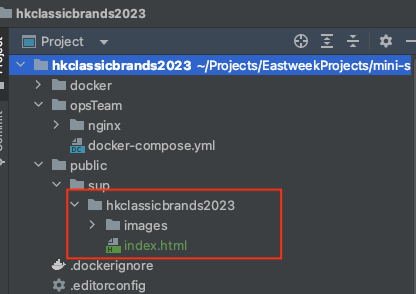

# How to build plain html mini site 


## Getting Started

### Prerequisites

- [Node.js](https://nodejs.org/) (>= 16.x required, >= 18.x preferred)
- [npm](https://www.npmjs.com/) (>= 7.x)
- [Git](https://git-scm.com/) (>= 2.0)
- Aliyun RAM account
- Docker
- Make cli

### Installation

```
# install it globally
$ npm install -g caz
```

### Quick Start

1. Create new project from antkwok template.
   e.g.: minisite name is [hkclassicbrands2023](https://eastweek-uat.stheadline.com/sup/hkclassicbrands2023/)

```sh
# use my template to generate project
$ caz antkwok/st-mini-site-html-docker hkclassicbrands2023

# follow the instruction
✔ Project name … hkclassicbrands2023
✔ Project version … v1.0.0
✔ Project description … Awesome html-docker apps.
✔ Project author name … Anthony Kwok
✔ Project author email … anthonykwok83@gmail.com
✔ aliyun container register namespace … eastweek-minisites
✔ aliyun container register container name … hkclassicbrands2023
? port › 8002

# After that the cli will return below
Created a new project in hkclassicbrands2023 by the antkwok/st-mini-site-html-docker template.

Getting Started:
  $ cd hkclassicbrands2023
  $ cp .env.developer.example .env.developer
  $ mkdir -p public/sup

  then place vendor's html code in it

# follow the script and try
```

2. Copy all html code from vendor/user to public/sup/{PATH_TO_YOUR_MINI_SITE}
   caution: if there is index_uat.html, please blame user or just rename to index.html
   
3. Run it in local
   ```sh
   docker-compose up --build --force-recreate --no-deps -d
   ```
4. If all fine, change the RAM user name in .env.developer file  
5. run below script to build and push to aliyun container registry
   ```sh
   make build_prod
   make push_prod
   ```
